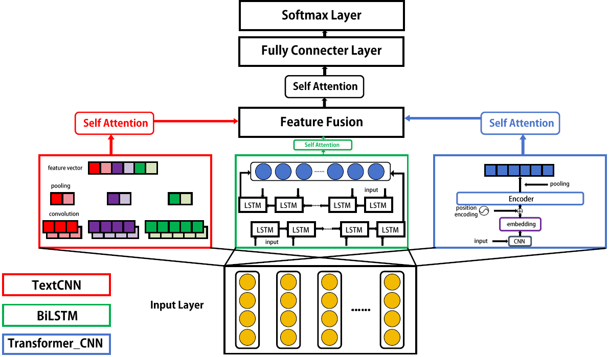
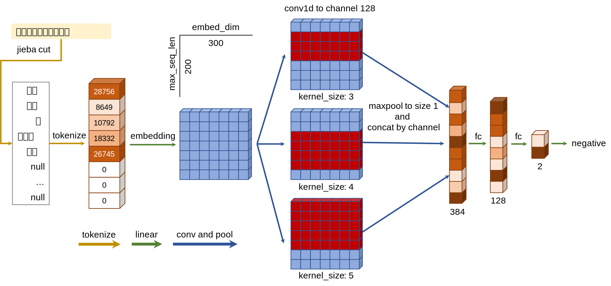

# 基于微博评论的情感分析实验


## 期末实现部分（2024.07.14）

### 更新部分

```shell
.
├── dataset
├── model
├── train.py
├── val.py
```

### 实现功能

通过PyTorch框架实现了基于Bert-TextCNN-BiLSTM-TransformerCNN-Attention的多模型并联融合情感分析任务。数据集基于微博评论数据集weibo-senti-100k，通过数据预处理、模型训练、模型融合等步骤，实现了对微博评论的情感分析任务。

我们对此进行了相关的消融实验，消融结果如下所示：

| Model                                  | Accuracy |                             Link                             |
| :------------------------------------- | :------: | :----------------------------------------------------------: |
| Embed+TextCNN                          |  0.9656  |                                                              |
| Bert+TextCNN                           |  0.9821  |                                                              |
| Bert+BiLSTM                            |  0.9789  |                                                              |
| Bert+TransformerCNN                    |  0.9798  |                                                              |
| Bert+TextCNN+Att                       |  0.9833  |                                                              |
| Bert+BiLSTM+Att                        |  0.9831  |                                                              |
| Bert+TextCNN+BiLSTM+Att                |  0.9835  |                                                              |
| Bert+TextCNN+BiLSTM+TransformerCNN+Att |  0.9835  | [Download](https://pan.baidu.com/s/1dlkkuZHrtELjy3-19J4N5Q?pwd=t4v0) |

其中，我们使用的Bert模型是[google-bert/bert-base-chinese](https://huggingface.co/google-bert/bert-base-chinese)，其具有强大的中文文本特征提取能力。在模型融合部分，均为我们自己编写实现的代码，我们通过在模型维度上进行结果的拼接，最后通过MutliHeadSelfAttention层以及全连接层进行结果的输出。

### 快速使用

通过`train.py`进行模型的训练，通过`val.py`进行模型的验证。`model`文件夹中包含了我们自己搭建的相关模型，由于模型较大，故未上传至仓库中。

### 模型概览



## 期中实现部分（2024.04.29）

本仓库是基于华为有限公司基座课程[《自然语言处理》——情感分析](https://connect.huaweicloud.com/courses/learn/course-v1:HuaweiX+CBUCNXA028+Self-paced/about)的Tensorflow以及PyTorch实现版本。

### 实现功能

通过Tensorflow以及PyTorch框架实现了基于TextCNN实现简单的二分类情感分析，其测试集准确率与指导书中大致一致，能够达到91%左右。

此外，在PyTorch版本中，我们设计了4个不同的参数和模型文件以适合不同的任务的任务需求，且拥有不同的参数大小。

|  类型  |    平台    |  参数量  | 模型大小 | 测试集准确率 |                             链接                             |
| :----: | :--------: | :------: | :------: | :----------: | :----------------------------------------------------------: |
| 原模型 | Tensorflow | 11038622 |   44MB   |    0.894     | [下载](https://pan.baidu.com/s/1ekZin3XVA0OntkX4RbWIJw?pwd=5qkl ) |
|   XL   |  PyTorch   | 3754934  |   15MB   |    0.903     | [下载](https://pan.baidu.com/s/1ekZin3XVA0OntkX4RbWIJw?pwd=5qkl ) |
|   L    |  PyTorch   | 1910684  |  7.6MB   |    0.891     | [下载](https://pan.baidu.com/s/1ekZin3XVA0OntkX4RbWIJw?pwd=5qkl ) |
|   M    |  PyTorch   |  416212  |  1.7MB   |    0.877     |                           仓库内含                           |
|   S    |  PyTorch   |  117366  |  469KB   |    0.853     |                           仓库内含                           |

### 快速使用

均在`tensorflow.ipynb`和`pytorch.ipynb`中有较为详细的说明，均支持重新训练和根据现有模型进行快速推理。

### 模型概览

本模型使用[ChnSentiCorp](https://www.sciencedirect.com/science/article/abs/pii/S0957417407001534)数据集进行训练和测试，通过[jieba](https://github.com/fxsjy/jieba)进行分词后将句子按照词数拓展或裁剪到指定长度。通过词向量嵌入后通过并行的多个CNN卷积层，获得不同的感受野。最后通过全连接层进行结果的输出。



